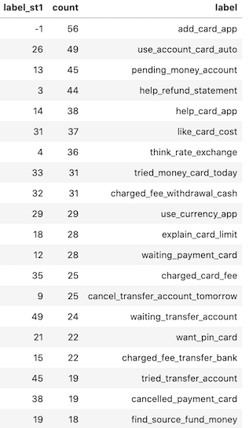

# chat-intents

ChatIntents provides a method for automatically clustering and applying descriptive group labels to short text documents containing dialogue intents.  It uses [UMAP](https://github.com/lmcinnes/umap) for performing dimensionality reduction on user-supplied document embeddings and [HDSBCAN](https://github.com/scikit-learn-contrib/hdbscan) for performing the clustering. Hyperparameters are automatically tuned by performing a Bayesian search (using [hyperopt](https://github.com/hyperopt/hyperopt)) on a constrained optimization of an objective function using user-supplied bounds.

**See associated Medium post for additional description and motivation.**

## Installation

Installation can be done using PyPI:

```pip install chatintents```

**Note:** Depending on your system setup and environment, you may encounter an error associated with the pip install of HDSBCAN (failure to build the hdbscan wheel). This is a [known issue](https://github.com/scikit-learn-contrib/hdbscan/issues/293) with HDSCAN and has several possible solutions. If you are already using a conda virtual environment, an easy solution is to conda install HDBSCAN *before* installing the chatintents package using:

```conda install -c conda-forge hdbscan```

### Sentence embeddings
The `chatintents` package doesn't include or specify how to create the sentence embeddings of the documents. Two popular pre-trained embedding models, as shown in the [tutorial notebook](https://github.com/dborrelli/chat-intents/blob/main/notebooks/chatintents_tutorial.ipynb), are the [Unversal Sentence Encoder (USE)](https://tfhub.dev/google/universal-sentence-encoder/4) and [Sentence Transformers](https://www.sbert.net/).

Sentence Transformers can be installed by:

```
pip install -U sentence-transformers
```

Universal Sentence Encoder requires installing

```
pip install tensorflow
pip install --upgrade tensorflow-hub
```

## Quick Start
The below example uses a Sentence Transformer model to embed the messages and create a model instance:

```
import chatintents
from chatintents import ChatIntents

from sentence_transformers import SentenceTransformer

all_intents = list(docs['text'])
model = SentenceTransformer('all-mpnet-base-v2')
embeddings = model.encode(all_intents)

model = ChatIntents(embeddings, 'st1')
```

Creating a ChatIntents instance requires inputs of an embedding representation of all documents and a short-text string description of the model (no spaces).

### Generating clusters
Methods are provided for generating clusters using user-supplied hyperparameters, from random search, and from a Bayesian search.

#### User-supplied hyperparameters and manually scoring
```
clusters = model.generate_clusters(n_neighbors = 15, 
                                   n_components = 5, 
                                   min_cluster_size = 5, 
                                   min_samples = None,
                                   random_state=42)

labels, cost = model.score_clusters(clusters)
```

#### Random search
To run 100 evaluations of randomly-selected hyperparameter values within user-supplied ranges:
```
space = {
        "n_neighbors": range(12,16),
        "n_components": range(3,7),
        "min_cluster_size": range(2,15),
        "min_samples": range(2,15)
    }

df_random = model.random_search(space, 100)
```

#### Bayesian search
Perform a Bayesian search of the hyperparameter space using hyperopt and user-supplied upper and lower bounds for the number of expected clusters:
```
hspace = {
    "n_neighbors": hp.choice('n_neighbors', range(3,16)),
    "n_components": hp.choice('n_components', range(3,16)),
    "min_cluster_size": hp.choice('min_cluster_size', range(2,16)),
    "min_samples": None,
    "random_state": 42
}

label_lower = 30
label_upper = 100
max_evals = 100

model.bayesian_search(space=hspace,
                      label_lower=label_lower, 
                      label_upper=label_upper, 
                      max_evals=max_evals)
```
Running the `bayesian_search` method on a model instance saves the best parameters and best clusters to that instance as variables. For example:

```
>>> model.best_params

{'min_cluster_size': 5,
 'min_samples': None,
 'n_components': 11,
 'n_neighbors': 3,
 'random_state': 42}
```

### Applying labels to best clusters from Bayesian search
After running the `bayesian_search` method to identify the best clusters for a given embedding model, descriptive labels can then be applied with:
```
df_summary, labeled_docs = model.apply_and_summarize_labels(docs[['text']])
```
This yields two results. The `df_summary` dataframe summarizing the count and descriptive label of each group:



and the `labeled_docs` dataframe with each document in the dataset and it's associated cluster number and descriptiive label:


### Evaluating performance if ground truth is known
Two methods are also supplied for evaluating and comparing the performance of different models if the ground truth labels happen to be known:

```
models = [model_use, model_st1, model_st2, model_st3]

df_comparison, labeled_docs_all_models = chatintents.evaluate_models(docs[['text', 'category']], models)
```
An example `df_comparison` dataframe comparing model performance is shown below:


## Tutorial
See this [tutorial notebook](https://github.com/dborrelli/chat-intents/blob/main/notebooks/chatintents_tutorial.ipynb) for an example of using the `chatintents` package for comparing four different models on a dataset.